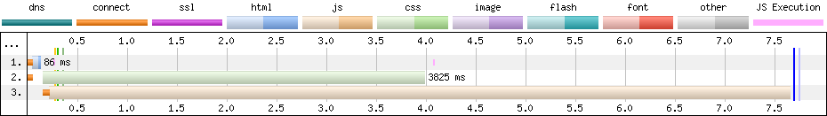
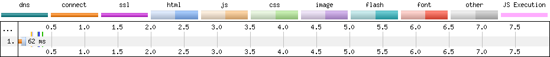

shortbread [![NPM version][npm-image]][npm-url] [![NPM downloads][npm-downloads]][npm-url] [![Build Status][travis-image]][travis-url] [![Coverage Status][coveralls-image]][coveralls-url] [![Dependency Status][depstat-image]][depstat-url] [![Development Dependency Status][devdepstat-image]][devdepstat-url]
===

is a Node module that helps you implement an asynchronous, non-blocking loading strategy for your CSS and JavaScript resources, thus improving the *start render time* of your websites. It's intendend to be part of your toolchain and plays well with Grunt, Gulp and alike.

Installation
------------

To add *shortbread* as a development dependency to your Node project, run

```bash
npm install shortbread --save-dev
```

Asynchronous resource loading
-----------------------------
Most often, not all the CSS and JavaScript resources referenced by your website are really necessary for initially rendering the page to your visitor. It makes sense to distinguish between critical and non-critical resources and defer the loading of non-critical ones until after the page got rendered to the screen. To further speed up things, it might also make sense to inline the most critical stuff directly into your HTML source when the page is loaded for the first time (and leverage browser caching on all subsequent visits).

*shortbread* wants to simplify these things for you. You only have to provide it with

* all the **JavaScript resources** you want to load,
* all your **CSS resources**,
* an optional **[critical CSS](https://www.smashingmagazine.com/2015/08/understanding-critical-css/)** resource (subject to inlining),
* an optional **cookie slot** (see below) and
* an optional **JavaScript callback** you want to call after all resources have been loaded for the first time.

Based on these values, *shortbread* creates **two HTML fragments** that you can include into the `<head>` of your documents. Anything else you need is some [server side code](#server-side-load-type-detection) to distinguish between the first and subsequent page loads and embed the appropriate fragment.


### First page load



The first page load fragment will accomplish the following:

1. First, it inlines some JavaScript (including parts of [Filament Group's loadCSS](https://github.com/filamentgroup/loadCSS)) that is needed to create a client-side *shortbread* instance and perform the following steps.
2. Next, it loads your JavaScript resources [with `async` and `defer`](https://www.igvita.com/2014/05/20/script-injected-async-scripts-considered-harmful/) and register them with *shortbread* once they finished loading.
3. It inlines your critical CSS (if any).
4. It loads your CSS resources [with `rel=preload`](https://www.w3.org/TR/2015/WD-preload-20150721/) (polyfilled if necessary) and register them with *shortbread* once they finished loading.
6. There's a `<noscript>` fallback for (synchronously) loading the CSS resources in case there's no JavaScript available.
7. As soon as all JavaScript and CSS resources finished loading, *shortbread*
    * sets a cookie for your server to distinguish between initial and subsequent page loads and
    * finally runs the JavaScript callback you provided (if any).


### Subsequent page loads



Based on the cookie set on intial page load, your server should be able to detect subsequent visits and include the alternative HTML fragment. This one leverages the browser cache and simply

1. loads your JavaScript resources (this time without `async` and `defer`) and
2. loads your CSS resources (synchronously as well).


### Shortbread cookie

The *shortbread* cookie serves two purposes:

1. If it is set, the server recognizes that the resources have already been loaded and switches into subsequent page load mode (i.e. it doesn't make the client load the resources asynchronously as they should have already been cached).
2. The expected cookie value represents a unique set of resources and changes whenever one of the resources changes in content. This way the cookie serves as a cache busting measure and ensures that the resources get updated as soon as they're modified on the server. Please be aware that you also need to adapt [the server-side code](#server-side-load-type-detection) whenever the resources change.


API
---

To use *shortbread* from JavaScript, you'd do the following (example for NodeJS):

```js
const shortbread = require('shortbread');
const fragments = shortbread(js, css, criticalCSS, 'main', 'allLoaded', {prefix: '/'});
```

The return value will be an object with the following properties:

```js
{
    initial: '<script>...</noscript>',      // Initial page load fragment
    subsequent: '<script>...</link>',       // Subsequent page load fragment
    resources: ['422a6fc6', '60062743'],    // Single resource hashes
    hash: 'df5bf8f7',                       // Cookie value when all resources are loaded
    cookie: 'sb_main'                       // Cookie name (here: including "main" slot)
}
```

You can use this object as a source of templating values when rendering the [the server-side code](#server-side-load-type-detection) to handle client requests.

The signature of `shortbread()` looks like this:

```js
/**
 * Create HTML fragments for assynchronously loading JavaScript and CSS resources
 *
 * @param {File|Array.<String,File>|Object.<String,File>} js  [OPTIONAL] JavaScript resource(s)
 * @param {File|Array.<String,File>|Object.<String,File>} css [OPTIONAL] CSS resource(s)
 * @param {File} critical                               [OPTIONAL] Critical CSS resource
 * @param {String} slot                                 [OPTIONAL] Cookie slot
 * @param {String} callback                             [OPTIONAL] Callback
 * @param {Object} config                               [OPTIONAL] Extended configuration
 */
function shortbread(js, css, critical, slot, callback, config) {
    // ...
}
```

### JavaScript and CSS resources

*shortbread* expects you to use [Vinyl objects](https://github.com/gulpjs/vinyl) to enter your JavaScript and CSS resources (`js`, `css` and `critical` arguments). When creating `<script src="...">` and `<link href="...">` elements, it uses the Vinyl objects' [`relative` property](https://github.com/gulpjs/vinyl#filerelative) to determine the request paths for your resources, so you can easily use virtual paths for your HTML output like in this example:

```js
const vinyl = require('vinyl-file');

const script = vinyl.readSync(path.join(__dirname, 'path/to/script.js'));
script.path = `${script.base}/js/mysite.js`;

// Will create `<script src="js/mysite.js" async defer></script>`
```

As you see, I recommend [vinyl-file](https://github.com/sindresorhus/vinyl-file) for creating Vinyl objects of your files.

For external resources you can also pass in absolute URLs for `js` and `css` instead of Vinyl objects.

### Cookie slot

By default, the name of the *shortbread* cookie is `sb`. If you're using multiple resource sets, however, you'll have to keep track of them separately by "slotting" the cookie. When you pass a `slot` argument to the `shortbread()` function, say `"set1"`, the cookie will be named `sb_set1`. The actual cookie name is returned in the `cookie` property of `shortbread()`'s result object.

### Extended configuration

The sixth argument to `shortbread()` may be an object with following properties:

| Property | Type     | Description                                    |
|----------|----------|------------------------------------------------|
| prefix   | String   | Prefix for all resource URLs (JavaScript and CSS). Set it to `"/"` for instance in order to use root-relative paths like `<script src="/path/to/script.js">`.|


Server side load type detection
-------------------------------

The way you implement the server-side load type detection totally depends on your environment and the technologies involved in your website. In most cases you will want to plug *shortbread* into a templating process that creates code snippets you can integrate into your setup and use for handling client requests. An example [handlebars](http://handlebarsjs.com/) template for creating a [PHP](http://php.net/) script could look like this:

```php
<!DOCTYPE html>
<html lang="en">
    <head><?php

        // If the shortbread cookie is present and matches the expected master hash: It's a subsequent page load
        if (!empty($_COOKIE['{{cookie}}']) && ($_COOKIE['{{cookie}}'] === '{{hash}}')):

            ?>{{{subsequent}}}<?php

        // Else: It's an initial page load
        else:

            ?>{{{initial}}}<?php

        endif;

        ?><meta charset="UTF-8">
        <title>My site</title>
    </head>
    <body>
        <!-- Page content -->
    </body>
</html>
```

This is, by the way, pretty much the code used by the **example implementation** included in this package. You can run it and see *shortbread* in action by typing

```
npm run php
```

in your console and directing your browser to 'http://localhost:8080'. Obviously, you will need PHP (CLI) to be installed on your machine for this.


Gulp usage
----------

`shortbread.stream()` is an additional interface that's intended to be used with streams and supports some extended features. Simply pass in the JavaScript and CSS resources you'd like to include (*shortbread* will seperate them internally — see below) and you'll get two HTML fragment files as the output.

The `shortbread.stream()` signature looks like this:

```js
/**
 * Streaming interface for shortbread
 *
 * @param {File} critical       [OPTIONAL] Critical CSS resource
 * @param {String} slot         [OPTIONAL] Cookie slot
 * @param {String} callback     [OPTIONAL] Callback
 * @param {Object} config       [OPTIONAL] Extended configuration
 */
function shortbread.stream(critical, slot, callback, config);
```

Again, the `critical` CSS (if any) needs to be passed in as a Vinyl object. Also the `slot` and `callback` arguments are identical to the [regular API](#api). The special `config` object defaults to these values:

```js
{
    css: ['\\.css$'],               // List of regular expressions to match CSS resources
    cssUrl: [],                     // List of external CSS resource URLs
    js: ['\\.js$'],                 // List of regular expressions to match JavaScript resources
    jsUrl: [],                      // List of external JS resource URLs
    initial: 'initial.html',        // Name for the initial page load HTML fragment
    subsequent: 'subsequent.html',  // Name for the subsequent page load HTML fragment
    data: false,                    // Whether to create a JSON file with shortbread's return values
    prefix: ''                      // Prefix for all resource URLs (see extended configuration)
}
```

As you see, *shortbread* uses regular expressions to filter and separate your CSS and JavaScript resources. Any file that's not matched by any of the regular expressions will simply get passed through (and might be used for further templating processes, see below). External resources given as URLs (`cssUrl` and `jsUrl`) don't get filtered or validated in any way.

In case you're using a cookie `slot`, the slot name will be added to the fragment file names as in `initial.<slot>.html` and `subsequent.<slot>.html`.

If you set `data` to `true`, an additional JSON file `shortbread.json` (respectively `shortbread.<slot>.json`) will be created that contains the *shortbread* [result object](#api). You could use this file as variable source for a downstream templating process when generating your [server side code](#server-side-load-type-detection). However, there's a much smarter approach to this:

As mentioned above, *shortbread* will simply pass through any file that's not recognized as a CSS or JavaScript resource. Additionally, it sets the `data` property of these files to *shortbread*'s result object which effectively emulates [gulp-data](https://github.com/colynb/gulp-data)'s behaviour. That way (and with the help of [gulp-filter](https://github.com/sindresorhus/gulp-filter)) you can immediately plug this into a variety of templating engines like [gulp-swig](https://github.com/colynb/gulp-swig) or [gulp-jade / gulp-pug](https://github.com/pugjs/gulp-pug). Here's a gulpfile example that uses [gulp-template](https://github.com/sindresorhus/gulp-template) to parse a [Lo-Dash / Underscore template](http://lodash.com/docs#template) and create a simple PHP request handler:

```js
const gulp = require('gulp');
const shortbread = require('shortbread').stream;
const vinyl = require('vinyl-file');
const path = require('path');
const filter = require('gulp-filter');
const template = require('gulp-template');

gulp.task('default', () => {
    const critical = vinyl.readSync('test/fixtures/critical.css');
    const tmpl = filter(['**/*.php'], { restore: true });

    // Start with your JavaScript, CSS and template resources
    gulp.src(['**/fixtures/script.js', '**/fixtures/style.css', 'gulp/*.php'], { cwd: path.join(__dirname, 'test') })

        // Run shortbread
        .pipe(shortbread(critical, 'main', null, { prefix: '/' }))

        // Filter all but the template file
        .pipe(tmpl)

        // Run the template engine
        .pipe(template())

        // Restore all files
        .pipe(tmpl.restore)

        // Write the files to their destination
        .pipe(gulp.dest('./tmp'));
});
```

The Lo-Dash / Underscore template might look like this:

```php
<!DOCTYPE html>
<html lang="en">
    <head><?php

        // If the shortbread cookie is present and matches the expected master hash: It's a subsequent page load
        if (!empty($_COOKIE['<%= cookie %>']) && ($_COOKIE['<%= cookie %>'] === '<%= hash %>')) {
            include 'subsequent.main.html';

        // Else: It's an initial page load
        } else {
            include 'initial.main.html';
        }

        ?><meta charset="UTF-8">
        <title>My site</title>
    </head>
    <body>
        <!-- Page content -->
    </body>
</html>

```


Known problems
--------------

Currently there are no known problems. However, the module is in a very early stage and might have severe bugs. Please let me know if you spot one!

To-do
-----

* Add tests


Changelog
---------

Please refer to the [changelog](CHANGELOG.md) for a complete release history.


Legal
-----
Copyright © 2017 Joschi Kuphal <joschi@kuphal.net> / [@jkphl](https://twitter.com/jkphl). *shortbread* is licensed under the terms of the [MIT license](LICENSE.txt).


[npm-url]: https://npmjs.org/package/shortbread
[npm-image]: https://badge.fury.io/js/shortbread.svg
[npm-downloads]: https://img.shields.io/npm/dm/shortbread.svg

[travis-url]: http://travis-ci.org/jkphl/shortbread
[travis-image]: https://secure.travis-ci.org/jkphl/shortbread.svg

[coveralls-url]: https://coveralls.io/r/jkphl/shortbread
[coveralls-image]: https://img.shields.io/coveralls/jkphl/shortbread.svg

[depstat-url]: https://david-dm.org/jkphl/shortbread#info=dependencies
[depstat-image]: https://david-dm.org/jkphl/shortbread.svg
[devdepstat-url]: https://david-dm.org/jkphl/shortbread#info=devDependencies
[devdepstat-image]: https://david-dm.org/jkphl/shortbread/dev-status.svg

